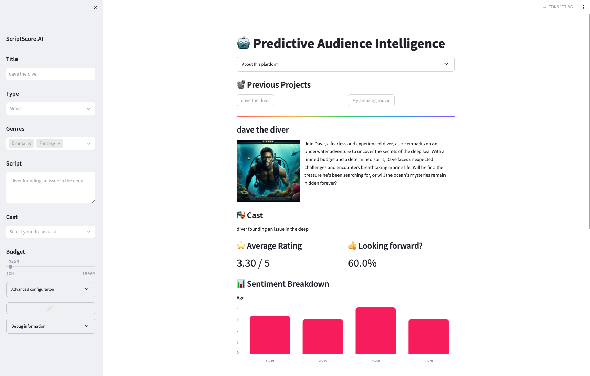

# Scriptscore.AI
This is a simple project that explores the use of LLMs to predict the success of the movie.
The app is built using GPTs, Streamlit, langchain and local persistence with SQLite. 

Futher development might include:
* looking into other SOTA models like Claude 3.5 Sonnet.
* exploring debiased models, eg. [Creativity Has Left the Chat: The Price of Debiasing Language Models](https://arxiv.org/abs/2406.05587)

# Demo

# Run
`streamlit run streamlit_app.py`
